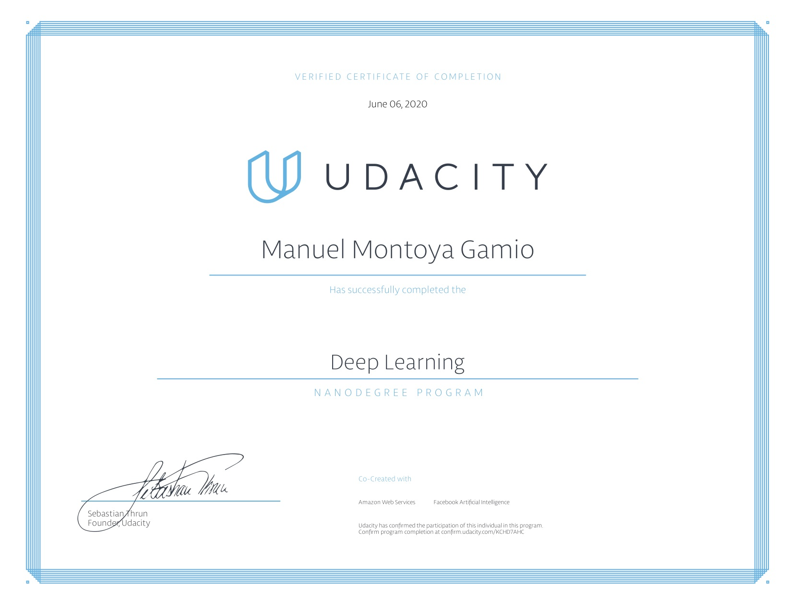

# Udacity Deep Learning Nanodegree

## Project 3: TV Script Generator

Generate a Seinfeld TV script using RNNs and Seinfeld dataset of scripts from 9 seasons. The Neural Network you'll build will generate a new, "fake" TV script.

 __Key concepts__: Recurrent neural networks, LSTM, GRU, text preprocessing, hyperparameter tuning

